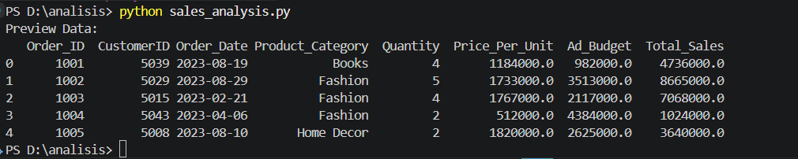
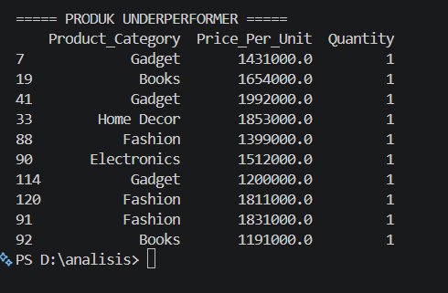
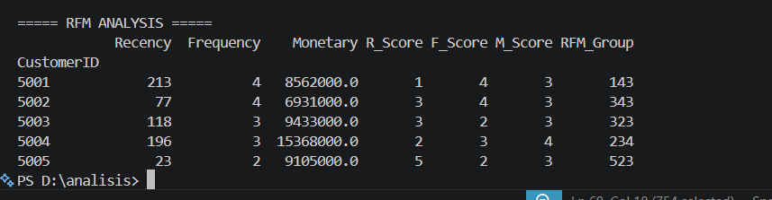
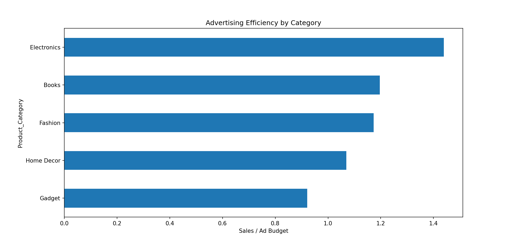

# Praktikum Analisis Data Penjualan

## 1. Business Question

Pada praktikum ini dilakukan analisis data penjualan untuk menjawab beberapa pertanyaan bisnis berikut:

- Produk apa yang memiliki harga tinggi tetapi volume penjualannya rendah?
- Bagaimana cara mengelompokkan pelanggan berdasarkan perilaku pembelian mereka?
- Kategori produk mana yang paling efisien dalam penggunaan anggaran iklan?
- Apakah anggaran iklan yang lebih tinggi benar-benar meningkatkan penjualan?

---

## 2. Data Preview

Dataset yang digunakan berisi informasi transaksi penjualan seperti ID pesanan, pelanggan, tanggal pembelian, kategori produk, jumlah barang, harga per unit, anggaran iklan, dan total penjualan.

Contoh beberapa baris pertama data dapat dilihat pada gambar berikut.

Dataset ini kemudian diproses menggunakan Python dengan library **Pandas** untuk mempermudah analisis.

---

## 3. Identifikasi Produk Underperformer

Analisis pertama bertujuan untuk menemukan produk yang memiliki harga relatif tinggi tetapi jumlah penjualannya rendah. Produk seperti ini sering disebut **underperformer** karena kurang efektif dalam menghasilkan penjualan.

Pada analisis ini digunakan scatter plot dengan:

- **Sumbu X** : Price Per Unit  
- **Sumbu Y** : Quantity  

Hasil identifikasi produk dengan quantity paling rendah ditunjukkan pada gambar berikut.

Dari hasil tersebut terlihat bahwa beberapa kategori produk memiliki harga yang cukup tinggi namun hanya terjual dalam jumlah kecil.

Hal ini bisa menjadi indikasi bahwa harga produk tersebut terlalu tinggi atau minat pasar terhadap produk tersebut rendah.

---

## 4. RFM Analysis (Segmentasi Pelanggan)

Selanjutnya dilakukan **RFM Analysis** untuk mengelompokkan pelanggan berdasarkan perilaku transaksi mereka.

RFM terdiri dari tiga komponen utama:

- **Recency** → seberapa lama sejak pelanggan terakhir melakukan pembelian  
- **Frequency** → seberapa sering pelanggan melakukan pembelian  
- **Monetary** → total pengeluaran pelanggan  

Hasil perhitungan RFM ditunjukkan pada tabel berikut.

Dengan metode ini, perusahaan dapat mengetahui pelanggan yang paling aktif dan memiliki kontribusi besar terhadap penjualan.

---

## 5. Analisis Efisiensi Iklan per Kategori

Pada tahap berikutnya dilakukan analisis untuk melihat seberapa efisien anggaran iklan pada setiap kategori produk.

Efisiensi dihitung dengan membandingkan **Total Sales dengan Ad Budget**.

Hasil perhitungan efisiensi dapat dilihat pada tabel berikut.

Kemudian hasil tersebut divisualisasikan dalam bentuk grafik.

Dari grafik terlihat bahwa kategori **Electronics** memiliki tingkat efisiensi iklan yang paling tinggi dibandingkan kategori lainnya.

Artinya setiap pengeluaran iklan pada kategori ini menghasilkan penjualan yang lebih besar.

---

## 6. Pengaruh Iklan terhadap Penjualan

Untuk mengetahui apakah anggaran iklan mempengaruhi penjualan, data dibagi menjadi dua kelompok:

- **Low Ads**
- **High Ads**

Kemudian dilakukan perbandingan menggunakan boxplot.

Dari hasil tersebut terlihat bahwa kelompok dengan anggaran iklan yang lebih tinggi cenderung memiliki nilai penjualan yang lebih besar dibandingkan kelompok dengan anggaran iklan rendah.

---

## 7. Insight

Beberapa insight yang dapat diperoleh dari analisis ini antara lain:

- Produk dengan harga tinggi tidak selalu memiliki volume penjualan yang tinggi.
- RFM Analysis membantu mengidentifikasi pelanggan yang paling loyal.
- Efisiensi penggunaan anggaran iklan berbeda pada setiap kategori produk.
- Kategori Electronics menunjukkan performa iklan yang paling baik.

---

## 8. Recommendation

Berdasarkan hasil analisis, beberapa rekomendasi yang dapat dipertimbangkan adalah:

- Meninjau kembali harga produk yang memiliki volume penjualan rendah.
- Memberikan program loyalitas kepada pelanggan dengan skor RFM tinggi.
- Mengalokasikan anggaran iklan lebih besar pada kategori produk yang memiliki efisiensi tinggi.

---

## Tools

Analisis dilakukan menggunakan beberapa tools berikut:

- Python
- Pandas
- Matplotlib
- Seaborn
- Scikit-Learn
